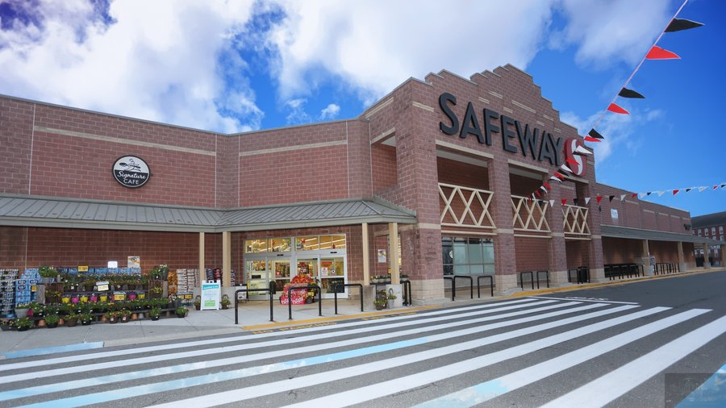

```{r global, include=FALSE}
# load data in 'global' chunk so it can be shared by all users of the dashboard
master_url <- "https://raw.githubusercontent.com/jhu-statprogramming-fall-2024/project4-apicons/refs/heads/main/master_neighbourhood_data.csv"
master_data <- read.csv(master_url)
master_url_2018 <- "https://raw.githubusercontent.com/jhu-statprogramming-fall-2024/project4-apicons/refs/heads/main/master_neighbourhood_data_2018.csv"
master_data_2018 <- read.csv(master_url_2018)
demo_master_url <- "https://raw.githubusercontent.com/jhu-statprogramming-fall-2024/project4-apicons/refs/heads/main/demo_master_data.csv"
demo_master_data <- read.csv(demo_master_url)
```

```{r setup, include=FALSE}
library(flexdashboard)
library(DT)
library(shiny)
library(ggplot2)
library(dplyr)
library(tidyverse)
library(jsonlite)
library(mapbaltimore)
library(leaflet)
library(tidygeocoder)
library(sf)
library(geosphere)
library(bslib)
library(knitr)
```

# Welcome

## column

### Welcome

```{r}
h1(strong("Welcome!"), style = "font-size:30px;")
```

This is a project created by three Biostatistics ScM students at Johns Hopkins University. Our research questions are:

**How has food accessibility across different neighborhoods in Baltimore changed since 2018?**\
**Which groups of people have easier or harder access to healthy food in Baltimore?**

In this dashboard, we explore food accessibility in Baltimore by neighborhood by looking at the distribution of grocery stores in Baltimore, the demographic characteristics of neighborhoods, and the accessibility of grocery stores in Baltimore. This is a resource for residents of Baltimore to find their nearest grocery store and learn more about their neighborhood, or for policymakers who are seeking a broad overview of food accessibility in Baltimore.

```{r}
h1(strong("Motivation"), style = "font-size:30px;")
```

The motivation for this project is to build upon [a 2018 study](https://planning.baltimorecity.gov/baltimore-food-policy-initiative/food-environment) conducted by the City of Baltimore Department of Planning and JHU Center for a Livable Future that identified neighborhoods in Baltimore City that are Healthy Food Priority Areas using more current data to see if food accessibility has changed during that time. A Healthy Food Priority Area is a neighborhood that meets the following criteria:

1.  The average Healthy Food Availability Index (HFAI) score\* is in the lowest tier.\
2.  The median household income is at or below 185% of the Federal Poverty Level\
3.  Over 30% of households do not have a vehicle available\
4.  The distance to a supermarket is more than ¼ mile\
    Source: City of Baltimore Department of Planning

\*The average HFAI score is a composite score that measures the availability of healthy food in a neighborhood. Each store (convenience store, supermarket, corner store etc.) is assigned a score based on its availability of healthy food options such as fresh produce and whole grains. The stores in each neighborhood are then averaged to get the neighborhood's HFAI score.

This is an important topic to study because food accessibility is a key determinant of health. In 2018, about 25% of Baltimoreans lived in a Healthy Food Priority Area, which demonstrates that this is a critical issue to public health in Baltimore ([Misiaszek et al, 2018)](https://clf.jhsph.edu/publications/baltimore-citys-food-environment-report-2018-report). Additionally, the pandemic brought economic hardship which may have worsened food accessibility. Identifying which areas are at highest priority for improving access can inform city leaders to create a healthier Baltimore

```{r}
h1(strong("Data Source"), style = "font-size:30px;")
```

We used data from the [Open Baltimore API](https://data.baltimorecity.gov/) to calculate the scores for each neighborhood. The neighborhood boundaries we used are called Community Statistical Areas (CSAs) and differ from zip code boundaries.

## column

### Dashboard Contents

```{r}
h1(strong("Dashboard Contents"), style = "font-size:24px;")
```

**Categorization of Baltimore Neighborhoods**  

This page displays maps of Baltimore that indicate the priority level of each neighborhood, both today and in 2018, and highlights neighborhoods that changed categories of healthy food priority. The maps also include information on food accessibility for each neighborhood. 

**Demographic Summary Statistics**

Visit this page to learn about the demographic characteristics of Baltimore neighborhoods and how they relate to food accessibility.

**Demographic Data Visualization**  

This page includes visualizations of demographic data by priority level, such as bar charts and box plots.                                   

**Find Your Nearest Grocery Store**

Visit this page to input your address and find the nearest grocery store. You can also find a map of all Baltimore grocery stores for your reference on this page.

### Pictured below: Safeway in Canton

```{r picture, echo = F, out.width = '50%'}

```

# Categorization of Baltimore Neighborhoods

Map of Baltimore neighborhoods with priority levels

```{r}
#Getting neighbourhood boundary geometries
csa_name_geometry <- mapbaltimore::csas %>%
  rename(CSA2010 = name)

# Adding geometries to master neighbourhood data 
master_data_with_geometry <- master_data %>% 
  left_join(csa_name_geometry, by = "CSA2010") 

#Turn into SF object
master_data_with_geometry <- st_as_sf(master_data_with_geometry)

# Transform CRS to 4326 (needed to interpret the multipolygon values)
master_data_with_geometry <- st_transform(master_data_with_geometry, crs = 4326)

# define factor for colours 
master_data_with_geometry$priority_level <- factor(
  master_data_with_geometry$priority_level,
  levels = c("High", "Medium", "Low")
)

#Set colour levels (for low medium and high categories) 
pal <- colorFactor(
  palette = c("red", "yellow", "green"), 
  domain = master_data_with_geometry$priority_level
)

#Plot map with colour coded neighbourhoods by priority level
leaflet(master_data_with_geometry) %>%
  addTiles() %>%  # Add base map tiles
  addPolygons(
    color = "blue",        # Border color
    weight = 1,            # Border thickness
    fillColor = ~pal(priority_level), # Fill color
    fillOpacity = 0.7,     # Transparency of the fill
    popup = ~paste0(
      "<strong>Neighborhood:</strong> ", CSA2010, "<br>",
      "<strong>Median Income:</strong> $", format(median_income, big.mark = ","), "<br>",
      "<strong>Percent Without Vehicle:</strong> ", round(percnt_no_vehicle, 1), "%<br>",
      "<strong>Healthy Food Availability Index Score:</strong> ", hfai_category, "<br>",
      "<strong>Has Grocery Store:</strong> ", ifelse(has_store == 1, "Yes", "No")
    ),
  #  label = ~paste0(
  #    CSA2010
  #  ),
  #  labelOptions = labelOptions(
  #    style = list("font-weight" = "bold"), # Bold text
  #    textsize = "12px",                   # Font size
  #    direction = "auto"                   # Automatically adjust label placement
  #  )
  ) %>%
  addLegend(
    position = "bottomright",
    colors = c("red", "yellow", "green"),         # Explicit color assignment
    labels = c("High", "Medium", "Low"),          # Explicit labels in desired order
    opacity = 0.7,
    title = "Neighbourhood Healthy Food Priority Level"
  )
```

## 2018 Map with priority levels

```{r}
#Getting neighbourhood boundary geometries
csa_name_geometry <- mapbaltimore::csas %>%
  rename(CSA2010 = name)

# Adding geometries to master neighbourhood data 
master_data_with_geometry_2018 <- master_data_2018 %>% 
  left_join(csa_name_geometry, by = "CSA2010") 

#Turn into SF object
master_data_with_geometry_2018 <- st_as_sf(master_data_with_geometry_2018)

# Transform CRS to 4326 (needed to interpret the multipolygon values)
master_data_with_geometry_2018 <- st_transform(master_data_with_geometry_2018, crs = 4326)

# define factor for colours 
master_data_with_geometry_2018$priority_level <- factor(
  master_data_with_geometry_2018$priority_level,
  levels = c("High", "Medium", "Low")
)

#Set colour levels (for low medium and high categories) 
pal <- colorFactor(
  palette = c("red", "yellow", "green"), 
  domain = master_data_with_geometry_2018$priority_level
)

#Plot map with colour coded neighbourhoods by priority level
leaflet(master_data_with_geometry_2018) %>%
  addTiles() %>%  # Add base map tiles
  addPolygons(
    color = "blue",        # Border color
    weight = 1,            # Border thickness
    fillColor = ~pal(priority_level), # Fill color
    fillOpacity = 0.7,     # Transparency of the fill
    popup = ~paste0(
      "<strong>Neighborhood:</strong> ", CSA2010, "<br>",
      "<strong>Median Income:</strong> $", format(median_income, big.mark = ","), "<br>",
      "<strong>Percent Without Vehicle:</strong> ", round(percnt_no_vehicle, 1), "%<br>",
      "<strong>Healthy Food Availability Index Score:</strong> ", hfai_category, "<br>",
      "<strong>Has Grocery Store:</strong> ", ifelse(has_store == 1, "Yes", "No")
    ),
   # label = ~paste0(
  #    CSA2010, "<br>",
  #    "Median Income: $", format(median_income, big.mark = ","), "<br>",
  #    "No Vehicle: ", round(percnt_no_vehicle, 1), "%<br>",
  #    "Grocery Store: ", ifelse(has_store == 1, "Yes", "No")
  #  ),
  #  labelOptions = labelOptions(
  #    style = list("font-weight" = "bold"), # Bold text
  #    textsize = "12px",                   # Font size
  #    direction = "auto"                   # Automatically adjust label placement
  #  )
  ) %>%
  addLegend(
    position = "bottomright",
    colors = c("red", "yellow", "green"),         # Explicit color assignment
    labels = c("High", "Medium", "Low"),          # Explicit labels in desired order
    opacity = 0.7,
    title = "Neighbourhood Healthy Food Priority Level"
  )
```

### Seeing which neighbourhoods changed category

```{r}
comparison_data <- master_data %>%
  inner_join(master_data_2018, by = "CSA2010", suffix = c("_master", "_master_2018"))

# Adding geometries to master neighbourhood data 
comparison_data_with_geometry <- comparison_data %>%
  left_join(csa_name_geometry, by = "CSA2010") 

#Turn into SF object
comparison_data_with_geometry <- st_as_sf(comparison_data_with_geometry)

# Transform CRS to 4326 (needed to interpret the multipolygon values)
comparison_data_with_geometry <- st_transform(comparison_data_with_geometry, crs = 4326)

# Plot
comparison_data <- comparison_data %>%
  mutate(comparison = ifelse(priority_level_master == priority_level_master_2018, "No Change", "Change")) 
priority_levels <- c("Low", "Medium", "High")

# Retain wide format for geom_segment
changed_categories_wide <- comparison_data %>%
  filter(comparison == "Change") %>%
  select(CSA2010, priority_level_master_2018, priority_level_master)

# Long format for colored points
changed_categories_long <- changed_categories_wide %>%
  pivot_longer(
    cols = c(priority_level_master_2018, priority_level_master),
    names_to = "year",
    values_to = "priority_level"
  ) %>%
  mutate(priority_level = factor(priority_level, levels = priority_levels),
         year = ifelse(year == "priority_level_master_2018", "2018", "2022"))

# Dumbbell plot
ggplot() +
  # Add connecting segments using wide data
  geom_segment(data = changed_categories_wide,
               aes(x = priority_level_master_2018, 
                   xend = priority_level_master, 
                   y = CSA2010, 
                   yend = CSA2010), 
               color = "grey") +
  # Add points using long data
  geom_point(data = changed_categories_long,
             aes(x = priority_level, y = CSA2010, color = year),
             size = 3) +
  scale_color_manual(values = c("2018" = "pink", "2022" = "red")) +
  labs(
    x = "Priority Level", 
    y = "Neighborhood", 
    title = "Changes in Priority Levels (2018 to 2022)",
    color = "Year"
  ) +
  theme_minimal() +
  theme(axis.text.y = element_text(size = 10))  # Adjust axis text size

```


# Demographic Summary Statistics

## Column

### Demographic Summary Statistics {data-width="400"}

```{r}
demo_master_stat <- demo_master_data %>% 
  select(priority_level, age18_22, age24_22, age64_22, age65_22, racdiv22, ppac22, paa22, pwhite22, phisp22, pasi22, lesshs21, hsdipl21) 
colnames(demo_master_stat) <- c("Priority Level", "Percent Age 5-17", " Percent Age 18-24", " Percent Age 25-64", " Percent Age 65+", "RDI Index", "Percent Other", "Percent African American", "Percent White", "Percent Hispanic", "Percent Asian", " Percent Less than High School", "Percent High School Diploma")
demo_summary <- demo_master_stat %>% 
  mutate(`Priority Level` = factor(`Priority Level`, levels = c("Low", "Medium", "High"))) %>% 
  group_by(`Priority Level`) %>% 
  summarise(across(everything(), list(Mean = ~round(mean(.x, na.rm = TRUE), 4), 
                                      Median = ~round(median(.x, na.rm = TRUE), 4),
                                      SD = ~round(sd(.x, na.rm = TRUE), 4)))) %>% 
  pivot_longer(-`Priority Level`, 
               names_to = c("Demographic Category", "stat"), 
               names_sep = "_") %>% 
  pivot_wider(names_from = stat, values_from = value)

datatable(demo_summary, options = list(pageLength = 36))
```

## Column

### Bar Chart: Demographic Data by Priority Level {data-width="600"}

```{r}
demo_master_stat <- demo_master_data %>% 
  select(priority_level, age18_22, age24_22, age64_22, age65_22, racdiv22, ppac22, paa22, pwhite22, phisp22, pasi22, lesshs21, hsdipl21) 
colnames(demo_master_stat) <- c("Priority Level", "% Age 5-17", "% Age 18-24", "% Age 25-64", "% Age 65+", "RDI Index", "%  Other", "% African American", "% White", "% Hispanic", "% Asian", "% Less than HS", "% HS Diploma")
demo_master_stat %>% 
  mutate(`Priority Level` = factor(`Priority Level`, levels = c("Low", "Medium", "High"), labels = c("L", "M", "H"))) %>% 
  pivot_longer(cols = `% Age 5-17`:`% HS Diploma`, 
               names_to = "variable", 
               values_to = "value") %>% 
  group_by(`Priority Level`, variable) %>% 
  mutate(variable = factor(variable, levels = c("Priority Level", "% Age 5-17", "% Age 18-24", "% Age 25-64", "% Age 65+", "RDI Index", "%  Other", "% African American", "% White", "% Hispanic", "% Asian", "% Less than HS", "% HS Diploma"))) %>% 
  summarise(mean_value = mean(value, na.rm = TRUE)) %>% 
  ggplot(aes(x = `Priority Level`, y = mean_value, fill = `Priority Level`)) +
  geom_bar(stat = "identity", position = "dodge") +
  scale_fill_manual(values = c("green", "yellow", "red")) +
  facet_wrap(~variable, scales = "free_y") +
  theme_minimal() +
  theme(strip.text = element_text(size = 10, hjust = 0.5),
    axis.text.x = element_text(size = 8),
    plot.title = element_text(size = 14)) +
  labs(title = "Demographic Categories by Priority Level",
       x = "Priority Level",
       y = " Mean Percent Value")
```

# Demographic Data Visualization

## Column

### Boxplot of age groups by priority level

```{r}
demo_master_data %>% 
  mutate(priority_level = factor(priority_level, levels = c("Low", "Medium", "High"))) %>% 
  select(priority_level, age18_22, age24_22, age64_22, age65_22) %>% 
  pivot_longer(cols = -priority_level, 
               names_to = "age_group", 
               values_to = "value") %>% 
  ggplot(aes(x = priority_level, y = value, fill = priority_level)) +
  geom_boxplot() +
  scale_fill_manual(values = c("green", "yellow", "red")) +
  facet_wrap(~age_group, scales = "free_y", labeller = as_labeller(
    c(age18_22 = "% Age 5-17",
      age24_22 = "% Age 18-24",
      age64_22 = "% Age 25-64",
      age65_22 = "% Age 65+"))) +
  theme_minimal() +
  theme(strip.text = element_text(size = 10, hjust = 0.5)) +
  labs(title = "Percent Age Distribution by Priority Level",
       x = "Priority Level",
       y = "Percent Value",
       fill = "Priority Level")
```

### Line Chart for Race Demographics by Priority Level

```{r}
demo_master_data %>% 
  mutate(priority_level = factor(priority_level, levels = c("Low", "Medium", "High"))) %>% 
  pivot_longer(cols = c(ppac22, paa22, pwhite22, phisp22, pasi22), 
               names_to = "race_variable", 
               values_to = "value") %>% 
  group_by(priority_level, race_variable) %>% 
  summarise(mean_value = mean(value, na.rm = TRUE)) %>% 
  ggplot(aes(x = race_variable, y = mean_value, group = priority_level, color = priority_level)) +
  geom_line(size = 1) +
  geom_point(size = 2) +
  scale_color_manual(values = c("green", "yellow", "red")) +
  scale_x_discrete(labels = c(ppac22 = "% Other",
                              paa22 = "% African American",
                              pwhite22 = "% White",
                              phisp22 = "% Hispanic",
                              pasi22 = "% Asian")) +
  theme_minimal() +
  theme(axis.text.x = element_text(angle = 45, hjust = 1, size = 10),
        plot.title = element_text(size = 12),
        legend.title = element_text(size = 10),
        legend.text = element_text(size = 8)) +
  labs(title = "Average Percentage of Race Demographics by Priority Level",
       x = "Race Demographic",
       y = "Average Percent Value",
       color = "Priority Level")
```

## Column

### Stacked Bar Chart for Race Demographics and Age Groups by Priority Level

```{r}
demo_master_data %>% 
  mutate(priority_level = factor(priority_level, levels = c("Low", "Medium", "High"))) %>%
  pivot_longer(cols = c(ppac22, paa22, pwhite22, phisp22, pasi22), 
               names_to = "variable", 
               values_to = "value") %>% 
  group_by(priority_level, variable) %>%
  summarise(mean_value = mean(value, na.rm = TRUE)) %>% 
  ggplot(aes(x = priority_level, y = mean_value, fill = variable)) +
  geom_bar(stat = "identity", position = "stack") +
  scale_fill_discrete(labels = c(
                              ppac22 = "% Other",
                              paa22 = "% African American",
                              pwhite22 = "% White",
                              phisp22 = "% Hispanic",
                              pasi22 = "% Asian")) +
  theme_minimal() +
  theme(plot.title = element_text(size = 11),
        legend.title = element_text(size = 10),
        legend.text = element_text(size = 8)) +
  labs(title = "Stacked Bar Chart for Average Percentage of Racial Groups by Priority Level",
       x = "Priority Level",
       y = "Average Percent Value",
       fill = "Demographic Category")
```

### Horizontal Bar Chart for Education Levels

```{r}
demo_master_data %>% 
  pivot_longer(cols = c(lesshs21, hsdipl21), names_to = "education", values_to = "value") %>% 
  group_by(priority_level, education) %>% 
  summarise(mean_value = mean(value, na.rm = TRUE)) %>% 
  mutate(priority_level = factor(priority_level, levels = c("Low", "Medium", "High")),
         education = factor(education, levels = c("lesshs21", "hsdipl21"),
                            labels = c("Less than High School", "High School Diploma"))) %>% 
  ggplot(aes(x = mean_value, y = education, fill = priority_level)) +
  geom_bar(stat = "identity", position = "dodge") +
  scale_fill_manual(values = c("green", "yellow", "red")) +
  theme_minimal() +
  theme(
    axis.text.y = element_text(size = 10),
    plot.title = element_text(size = 12),
    legend.title = element_text(size = 10),
    legend.text = element_text(size = 8)
  ) +
  labs(title = "Average Percentage of Education Levels by Priority Level",
       x = "Average Percent Value",
       y = "Education Level",
       fill = "Priority Level")
```

# Find Your Nearest Grocery Store

### Address Lookup

```{r}
grocery_store_url <- "https://services1.arcgis.com/UWYHeuuJISiGmgXx/arcgis/rest/services/Grocery_Store/FeatureServer/0/query?where=1%3D1&outFields=*&outSR=4326&f=json"

jsonData <- read_json(grocery_store_url, simplifyVector = TRUE)

grocery_stores <- jsonData$features$attributes

nearest_store <- function(address, city, state, zip) {
   if (address == "" | city == ""){
    stop('Please enter a valid address including at minimum street address and city.')
  }
  address_to_geocode <- data.frame(address = 
                      paste(address, ", ", city, ", ", state, " ", zip, sep = ""))
 
  coordinates <- suppressMessages(tidygeocoder::geocode(address_to_geocode, address, method = "osm"))
  address.coords <- data.frame(
    lats = coordinates$lat,
    lons = coordinates$long)
  
  grocery.store.coords <-
   data.frame(
    name = grocery_stores$storename,
    address_groc = grocery_stores$address,
    lats_ = grocery_stores$latitude,
    lons_ = grocery_stores$longitude)
  
  new <- grocery.store.coords %>% rowwise() %>%
  mutate(new =  map(list(c(lons_, lats_)), ~ address.coords %>% rowwise() %>%
                      mutate(dist = distGeo((c(lons, lats)), .x)) %>%
                      ungroup %>%
                      filter(dist == min(dist))))  %>%
  ungroup() %>% unnest_wider(new) %>% 
  filter(dist == min(dist)) 
  
  distance <- round(new$dist*0.000621371,2)
  
  first <- paste0("Your nearest grocery store is ", new$name, " at ", new$address_groc, ".")
  
  second <- paste0("It is ", distance, " miles from your inputted address, ", paste(address, ", ", city, ", ", state, " ", zip, sep = ""), ".")
  
   return(c(first, second))
}

coords <- function(address, city, state, zip) {
  address_to_geocode <- data.frame(address = 
                      paste(address, ", ", city, ", ", state, " ", zip, sep = ""))
 
  coordinates <- suppressMessages(tidygeocoder::geocode(address_to_geocode, address, method = "osm"))
  
    address.coords <- data.frame(
    lats = coordinates$lat,
    lons = coordinates$long)
  
  grocery.store.coords <-
   data.frame(
    name = grocery_stores$storename,
    address_groc = grocery_stores$address,
    lats_ = grocery_stores$latitude,
    lons_ = grocery_stores$longitude)
  
  new <- grocery.store.coords %>% rowwise() %>%
  mutate(new =  map(list(c(lons_, lats_)), ~ address.coords %>% rowwise() %>%
                      mutate(dist = distGeo((c(lons, lats)), .x)) %>%
                      ungroup %>%
                      filter(dist == min(dist))))  %>%
  ungroup() %>% unnest_wider(new) %>% 
  filter(dist == min(dist)) 
  
  icon.ion <- makeAwesomeIcon(icon = 'home', markerColor = 'green', library='ion')
  
  leaflet() %>%
  addTiles() %>%
  addMarkers(lng=new$lons_, lat=new$lats_, label = new$name) %>% 
  addAwesomeMarkers(
    lng=coordinates$long, lat=coordinates$lat,
    label=paste(address, ", ", city, ", ", state, " ", zip, sep = ""),
    icon = icon.ion)
}
```

```{r}
h1(strong("Find your nearest grocery store!"), style = "font-size:30px;")

ui <- fluidPage(
  sidebarPanel(
  textInput('address', "Street Address", value = "", width = NULL, placeholder = NULL),
textInput('city', "City", value = "", width = NULL, placeholder = NULL),
textInput('state', "State", value = "", width = NULL, placeholder = NULL),
textInput('zip', "Zip Code", value = "", width = NULL, placeholder = NULL),
actionButton("go", "Go"),
  textOutput("add"), width = 5
),
mainPanel(
  leafletOutput("map"), width = 7
)
)

server <- function(input, output) {
  
  store <- eventReactive(input$go, {nearest_store(input$address, input$city, input$state, input$zip)})
  c <- eventReactive(input$go, {coords(input$address, input$city, input$state, input$zip)})

  output$add <- renderText(store())
  output$map <- renderLeaflet(c())
}

shinyApp(ui, server)
```

### Map of All Baltimore Grocery Stores

```{r}
# Create the leaflet map
leaflet(master_data_with_geometry) %>%
  addTiles() %>% # Add base map tiles
  addPolygons(
    color = "black",                 
    weight = 1,                       
    fillColor = "transparent",       
    fillOpacity = 0,                
    popup = ~paste0("<strong>Neighborhood:</strong> ", CSA2010), 
    label = ~CSA2010,                 
    labelOptions = labelOptions(
      style = list("font-weight" = "bold"), 
      textsize = "12px",
      direction = "auto"
    )
  ) %>%
  addMarkers(
    data = grocery_stores,     
    lng = ~longitude,          
    lat = ~latitude,                
    popup = ~paste0(
      "<strong>Store Name:</strong> ", storename, "<br>",
      "<strong>Address:</strong> ", address)
  )
```
